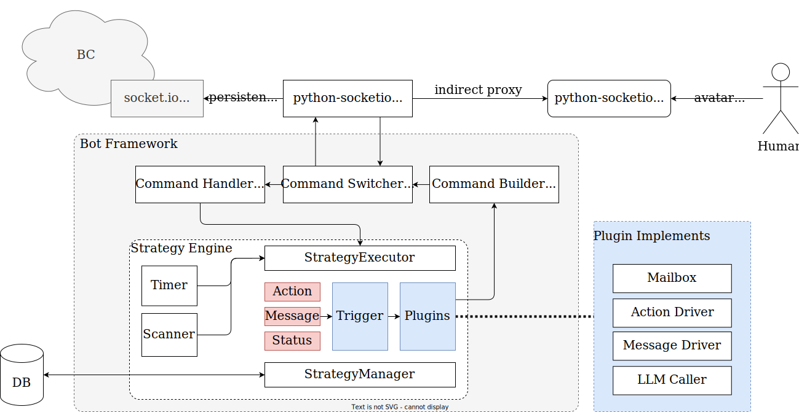

# What is this？

A bot program for the Bondage Club online game ([https://www.bondageprojects.com/club_game/](https://www.bondageprojects.com/club_game/)).

# When will it finished?

Well, idk actually.

I'll work on making progress during my breaks, though, unfortunately, the time never seems to be enough.

# Development roadmap

## 1. Framework

- socket.io connection
- connection proxy
- full command handle

## 2. Bot Basic Ability

- interactive action
- afk message box
- message command
- conversation log
- ... and other

## 3. Advanced Ability

- Transparent possession (directly take over the bot without relogin)
- LLM conversation & command understand
- ... and other

# Overall architecture

